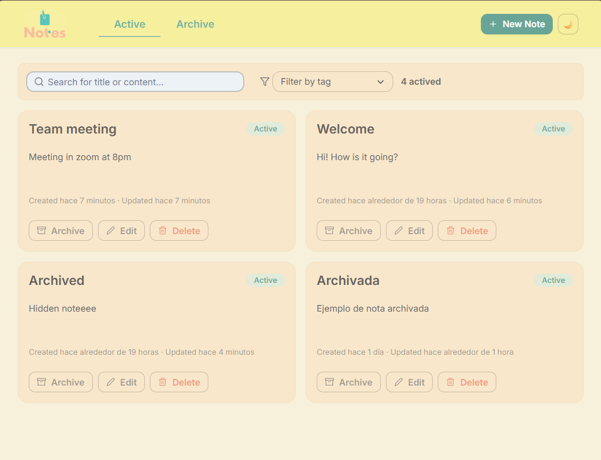
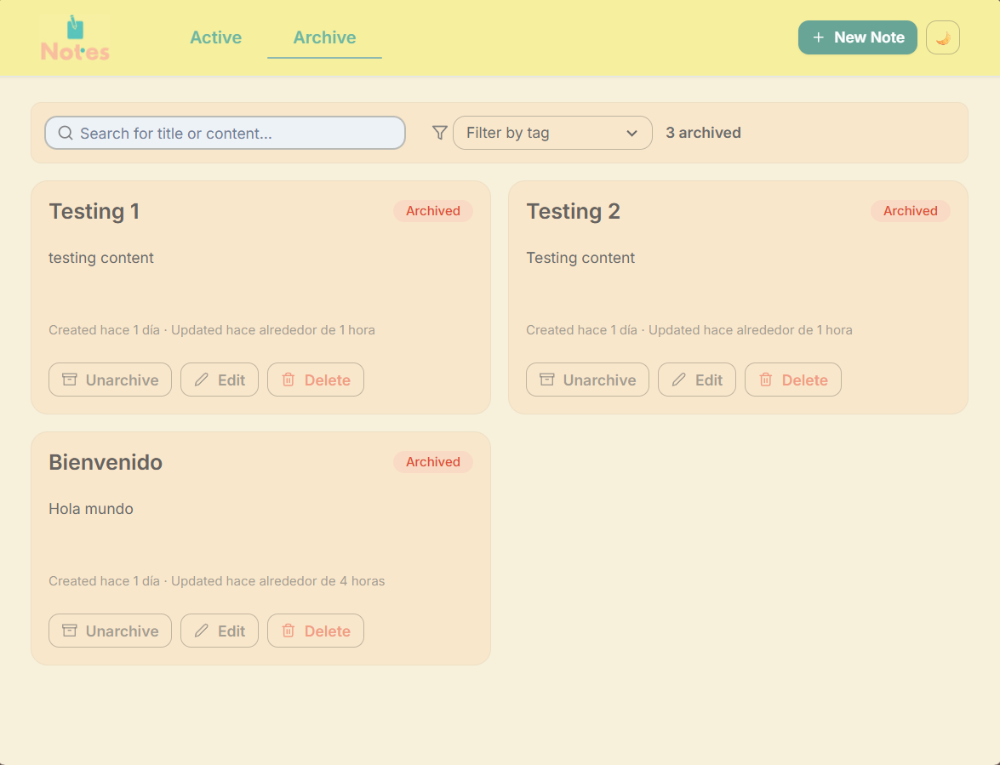
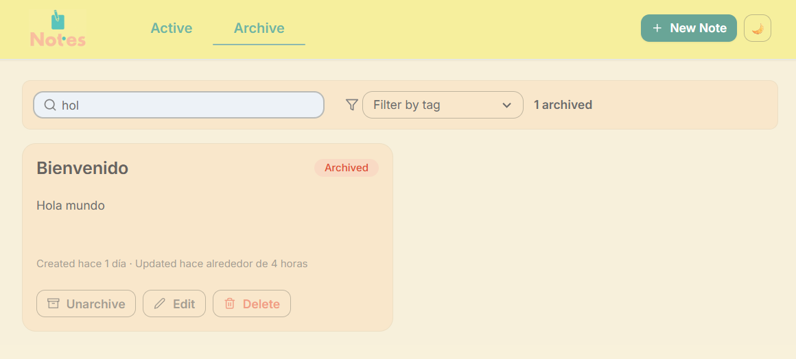

# Notes — Full‑stack Challenge

A small, production‑style **notes** app with search, tags and archiving. It ships with a modern UI (Chakra UI + React Query), a documented API (Swagger), and a **1‑command Docker** setup.

> This repository implements the requested *Phase 1 & 2* scope and adds a few UX niceties (dark mode, toasts, animated tabs, quick‑edit drawer).

## Screenshots

All screenshots are in [`/docs/screenshots`](./docs/screenshots). A few samples:





(…more in the folder.)

## Requirements

- **Node** v22.12.0
- **npm** 10.9.0
- **Docker** 28.5.1

> You only need Docker to run the app. Node/npm are useful for local dev.

## Quick start (Docker)

```bash
docker compose up -d --build
# Optional: ensure Prisma schema is in sync
docker compose exec backend npm run prisma:generate
docker compose exec backend npm run prisma:db:push

# URLs
# Frontend  → http://localhost:5173
# API       → http://localhost:3000
# Swagger   → http://localhost:3000/api
```

If this is the first run, open the UI and create a couple of notes.

## Environment variables

Create a `.env` from `.env.example` in the repo root.

```ini
# backend
DATABASE_URL=postgresql://postgres:postgres@db:5432/notesdb?schema=public
PORT=3000
CORS_ORIGIN=http://localhost:5173

# frontend
VITE_API_URL=http://localhost:3000
```

## Endpoints

- `GET /notes?archived=<bool>&tag=<string>&q=<string>`
- `POST /notes`
- `PATCH /notes/:id`
- `DELETE /notes/:id`
- `GET /tags`
- Swagger: `/api`

## Tech stack

Frontend: React + Vite + TypeScript, Chakra UI, React Query, Framer Motion  
Backend: Node (Nest/Express), Prisma, Swagger, PostgreSQL

## Repo layout
```
/backend
/frontend
docker-compose.yml
```

## Extras
- Dark mode
- Toasts + confirm delete
- Animated tabs
- Quick‑edit drawer
- Relative time (“created/updated … ago”)

## Next steps
- Tests (unit + integration)
- Auth (JWT), multi‑user
- Full‑text search / indexes
- CI (lint/typecheck/tests)
